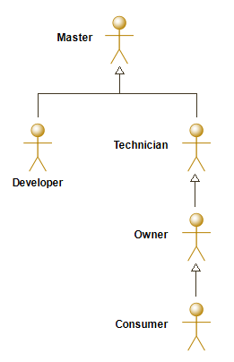
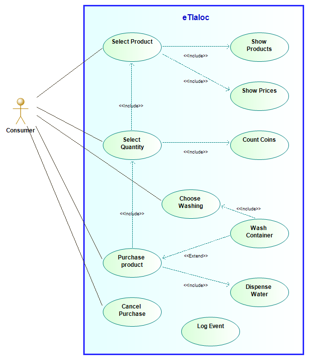
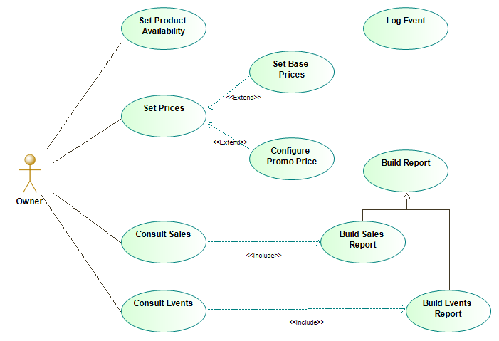
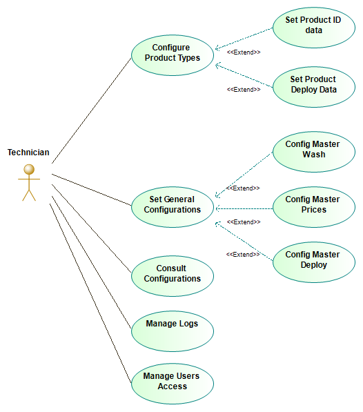
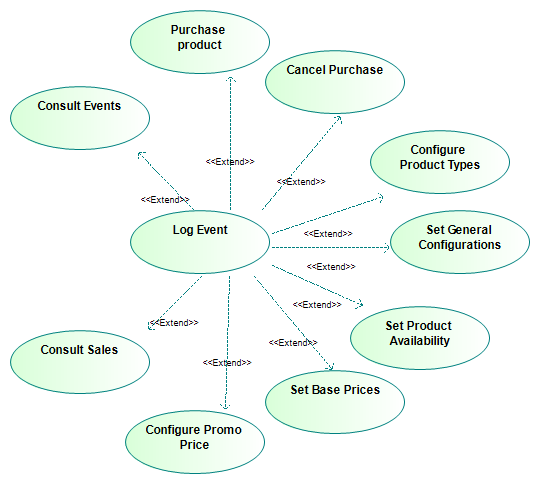
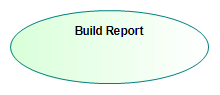

# eTlaloc SW Architecture

[TOC]

## Use Case Analysis

### Actors

Figure below represents the relation among the different actors participating in the eTlaloc system. Table below provides a description for each of them.

 

*Figure 'ucd_actors'*

| Actor name              | Description             |
| ----------------------- | ----------------------- |
| Master     |      |
| Developer  | The 'Developer' actor represents a SW developer for the eTlaloc system.  |
| Technician | The 'Technician' actor is the person that can perform maintenance to the water shop. |
| Owner      | The 'Owner' actor is the person that owns the water shop.      |
| Consumer   | Consumer actor represents the final-user that wants to buy water.   |

### Use Case Diagrams

#### Diagram 'ucd_top_Consumer'

*Figure 'ucd_top_Consumer'*

#### Diagram 'ucd_top_Owner'

*Figure 'ucd_top_Owner'*

#### Diagram 'ucd_top_Technician'

*Figure 'ucd_top_Technician'*

#### Diagram 'ucd_lvl1_logging'

*Figure 'ucd_lvl1_logging'*

#### Diagram 'ucd_lvl1_reporting'

*Figure 'ucd_lvl1_reporting'*

### Use Cases

TBD

#### Use case 'TBD'

TBD

##### Activity 'TBD'

TBD
